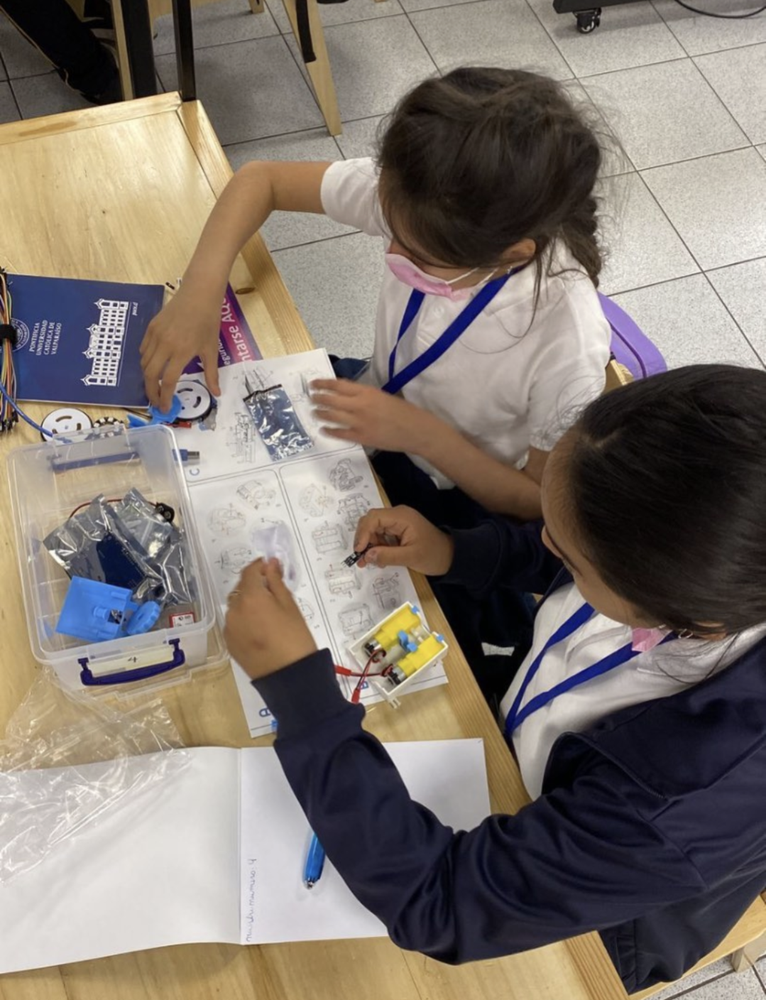
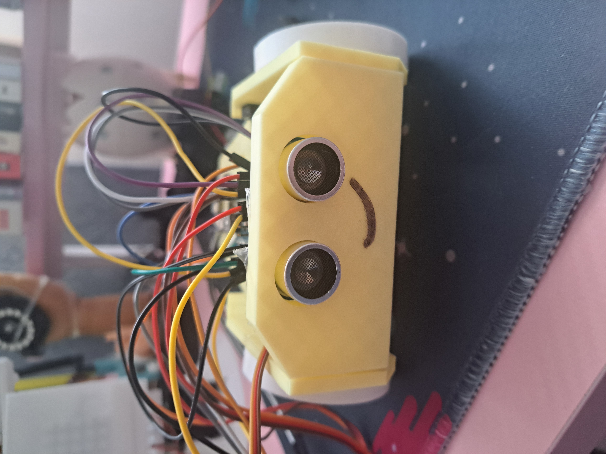

# Diplomado en Robótica Educativa (RE)
1. [Datos Generales](#datos-generales)
2. [Objetivos](#objetivos)
3. [Kit de Robótica Educativa](#kit-de-robótica-educativa)
4. [Módulos](#módulos)

**La educación está cambiando** y con ella, cambian nuestras aulas, nuestros estudiantes ....y también nosotros los docentes. 

Hoy más que nunca, enfrentamos el desafío de enseñar a generaciones que nacieron en la tecnología en sus manos. Niños y Niñas que sueñan con explorar Marte, contruir sus propios inventos o cambiar el mundo con una idea. 

**¿Y si les damos las herramientas para hacerlo?**
Este diplomado nace de una convicción produnda: La robótica no es solo cables y motores, sino una puerta hacia la creatividad, el trabajo en equipo, la resolución de problemas y el pensamiento crítico. 

Queremos invitarte a que te conviertas en **agente de cambio en tu escuela**, a que inspires a tus estudiantes no solo a aprender, sino a **crear**.

Aquí no solo vas a aprender robótica. 
Vas a vivir la robótica como una experiencia educativa transformadora.
Bienvenido y bienbenida al desafío de llevar la educación al siguiente nivel. 

**Bienvenido al Diplomado en Robótica Educativa** desde un enfoque STEM dictado por las **Escuela de Informática** y **Escuela de Pedagogía** de la **Pontificia Universidad Católica de Valparaíso**

**¿Por qué este Diplomado?**
Los desafíos del siglo XXI exigen una educación que despierte la creatividad, el pensamiento crítico y el trabajo colaborativo.
La robótica es mucho más que tecnología, es una herramienta para transformar la enseñanza.

**¿Qué lograrás?**
 - Diseñar, construir y programar tu propio robot educativo.
 - Integrar metodologías STEM en el aula. 
 - Aplicar tecnología con propósito pedagógico.
 - Inspirar a tus estudiantes a aprender haciendo.

**¿A quién está dirigido?**
A docentes como tú, que creen en una educación más activa, más práctica, más significativa. No necesitas experiencia previa en robótica. Solo tus ganas de aprender y transformar. 

## Datos Generales
- Duración: 93 horas
- Modalidad: Virtual
- Horario:
        Viernes: 19:00 – 22:15
        Sábado: 10:00 – 13:15
        (con break de 15 minutos por sesión)
    Compatible con tu horario laboral
- Público objetivo: Profesorado Escolar, e interesado en aprender en robótica educativa.

## Objetivos
**🎯 Objetivo General**
Capacitar al Profesorado Escolar en el diseño, construcción y programación de sistemas de robótica educativa, integrando didáctica, electrónica e informática contextualizadas al aula.

**📌 Objetivos Específicos**
- Integrar la robótica en el currículo STEM.
- Capacitar en diseño, impresión 3D y electrónica aplicada.
- Aplicar programación (incluida inteligencia artificial) a proyectos robóticos educativos.

## 💡 Metodología Práctica
- Aprender haciendo: proyectos reales desde la primera semana.
- Trabajo guiado por docentes expertos.
- Evaluaciones centradas en tus avances y propuestas.

-----
## Kit de Robótica Educativa
 - Arduino Nano 
 - 2 mini-servos MG90 **giro continuo** (engranajes metálicos)
 - Módulo RGB 8 Leds
 - Shield de extensión Arduino Nano
 - 2 baterias 18650 
 - PortaBateria con conector jack para 2 celdas 18650
 - Buzzer (zumbador piezoeléctrico)
 - Ultrasonido HC-SR04
 - Interruptor Rocker 2 posiciones
 - Piezas en 3D
 - HC-05
 - Cables Dupont Macho-Hembra 20cm
 - Cables Dupont Macho-macho 20cm

 Los modelos 3D se encuentran [Aquí](https://github.com/sancano22/RoboticaEducativa/tree/main/Modelo3D)

 

**¿Dónde puedes adquirir el Kit?**
En Mechatronicstore.cl

----

## Módulos
#### 1. Innovación Tecnológica en el Aula desde una perspectiva STEM
**Objetivo de la sesión:** Reconocer la robótica educativa en un contexto internacional de innovación tecnológico-educativa.

**Descripción de la sesión:** Se abordan los conceptos de innovación aplicados a la educación, con un enfoque en la educación especial y de oficios, a través de experiencias desarrolladas. Posteriormente se introducirá la robótica educativa desde una perspectiva STEM. Se presentará el robot educativo móvil que acompañará el desarrollo práctico durante todo el diplomado.

#### 2. Planificación Didáctica con enfoque STEM aplicada a la robótica educativa.
**Objetivo de la sesión:** Esbozar una secuencia didáctica integrando la robótica educativa y la metodología STEM.

**Descripción de la sesión:** Se presenta STEM como una metodología activa interdisciplinaria, explorando las oportunidades que ofrece desde de la robótica educativa. Luego, se guiará a los participantes en la etapa inicial de planificación de sus proyectos didácticos.

#### 3. Diseño e Impresión 3D para Robótica Educativa
**Objetivo de la sesión:** Comprender las bases del diseño y la impresión 3D aplicadas a la robótica educativa.

**Descripción de la sesión:** Se muestran los distintos componentes del robot y los elementos clave en su diseño, analizando las instrucciones de ejecución de este a partir de un ejemplo práctico. Posteriormente se identifican posibilidades de modificación de las piezas del robot en función de las necesidades de uso.

#### 4. Electrónica Básica aplicada a la robótica
**Objetivo de la sesión:** Construir un kit de robótica educativa a partir de la aplicación de conocimientos de electrónica básica.

**Descripción de la sesión:** Se detallan conceptos básicos de electrónica, incluyendo sensores, actuadores, lógica digital y protoboard, además de una introducción a la programación de Arduino. En segunda instancia Los participantes comenzarán a construir sus kits, comprendiendo los conceptos básicos a través de la práctica.

#### 5. Programacion aplicada a la Robótica Educativa
**Objetivo de la sesión:** Programar un kit de robótica educativa a partir de la aplicación de conocimientos básicos de programación por bloques. 

**Descripción de la sesión:** Se demuestran conceptos de programación a través de bloques, seguido de instrucciones prácticas para programar el robot ensamblado. Posteriormente, el kit se conectará al computador utilizando Arduino, culminando en la aplicación tangible de la programación en el proyecto.

#### 6. Laboratorio de Innovación Educativa
**Objetivo de la sesión:** Probar los kits de robótica en virtud del diseño de planificación didáctica.

**Descripción de la sesión:** Cada participante demuestra el funcionamiento de su kit en relación con el proyecto STEAM diseñado. Posteriormente reciben retroalimentación de sus pares y docentes a cargo del taller para introducir mejoras en el ámbito didáctico, electrónico y/o de programación.

#### 7. Inteligencia Artificial en Robótica Educativa
**Objetivo de la sesión:** Explorar alternativas de programación del kit de robótica a partir del uso de Inteligencia Artificial.

**Descripción de la sesión:** Se demuestran conceptos de programación con IA aplicados al kit de robótica. Luego de ello, se exploran oportunidades de mejora de los proyectos en base al uso de IA.

#### 8. Feria de Robótica Educativa Virtual
**Objetivo de la sesión:** Visibilizar y compartir los proyectos desarrollados por los participantes del diplomado, promoviendo el aprendizaje colaborativo, la creatividad y la aplicación de la robótica educativa en contextos reales.

**Descripción de la sesión:** Los participantes exponen sus proyectos STEM en una feria de robótica educativa dando cuenta de sus conocimientos teórico-prácticos en didáctica, electrónica y programación aplicados al kit.